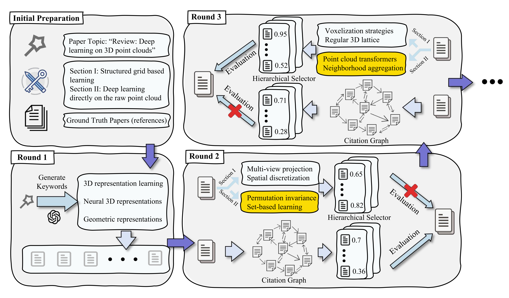

# Trajectory Generation

This project contains a core component of our research paper, specifically focusing on the **Trajectory Generation** stage. It automates the synthesis of research evolution paths by processing academic papers through specialized models and academic APIs.

---

## 📊 Process Overview



---

## 🛠 Prerequisites

Before running the generation script, please ensure you have completed the following setup:

### 1. Model & Weights
You must obtain the following folders from the [PASA (ByteDance)](https://github.com/bytedance/pasa) repository:
* `transformer/`: The core model architecture.
* `checkpoints/pasa-7b-selector/`: The pre-trained model weights.

Ensure these are placed in the root directory of this project.

### 2. API Key Configuration
The system requires valid API keys for the following services:
* **DeepSeek Key**: For LLM-based reasoning and keywords-generation.
* **Serper Key**: For real-time web search and validation.
* **AMiner Key**: For accessing academic paper details and citation data.

---

## 📂 Project Structure

* `raw_papers/`: Contains 100 sample paper datasets for testing.
* `trajectory_result/`: Contains the generated trajectories for the 100 papers from the `raw_papers/` folder.
* `trajectory_generation.py`: The main execution script.

---

## 🚀 Usage

1. First, install the required dependencies using the following command:

    ```bash
    pip install -r requirements.txt
    ```

2. To start the trajectory generation process, simply run the following command:

    ```bash
    python3 trajectory_generation.py
    ```

This will generate trajectories based on the papers in `raw_papers/` and save the results in the `trajectory_result/` folder.